# The Scarlet Thread: Storyboard

**The gospel from Genesis to Revelation, in 60 seconds.**
1920×1080 · 24 fps · about 60 s · synthesized score

## Concept

The whole Bible is one story. God makes a promise in Genesis 3:15, and every later chapter is a
stitch in that promise until it is fulfilled in Jesus and completed in Revelation.

The film is **one continuous tracking shot** across a single panoramic world. There are no cuts.
A **scarlet thread** appears at the first promise and is sewn through every scene. It passes
through the ram, the doorposts, the veil, the crown, the scroll, the manger and the cross, and
it ends at the throne of the Lamb. In the last shot the camera pulls back and shows the whole
world at once: every scene joined by one thread.

The thread stands for the promise of redemption: the "seed of the woman", the Lamb and the King.
Its red recalls Rahab's scarlet cord (Joshua 2:18) and the blood of the Passover.

### Visual rules
- **Camera:** eased dollies between scenes, 1.0 s of travel and 3.3 s holding on each scene. The
  camera zooms out slightly while it travels and settles back in when it arrives. Background
  layers move at different speeds (parallax) for depth.
- **Thread:** its tip leads the camera and reaches each scene's focal point as the camera arrives.
  Between scenes it arcs up like a needle stitch, and a highlight flows along it.
- **Recurring motifs:** the **lamb** appears three times (the ram in Genesis 22, the Passover
  lamb, and the Lamb on the throne). The **tree of life** appears in Eden and again in the New
  Jerusalem. The **serpent** appears in Genesis 3 and is crushed at the empty tomb.
- **Sky:** changes with the story. Morning in Eden, dusk at the Fall, night for the promises,
  darkness at the cross, dawn at the resurrection and full light in the New Creation.

## Shot list

Still frames for each shot are in [`storyboard/`](storyboard/). Each is taken 2 s after the camera lands.

| | | | |
|---|---|---|---|
| 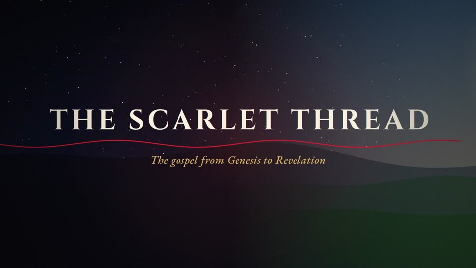 | 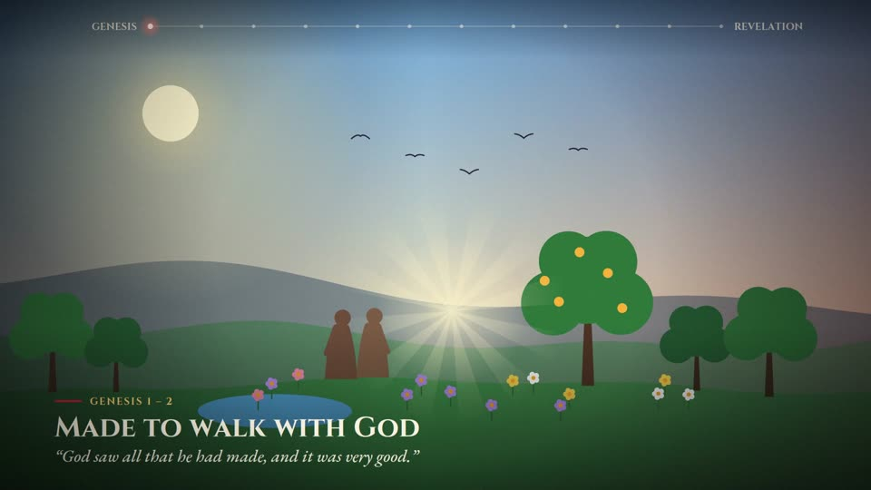 | 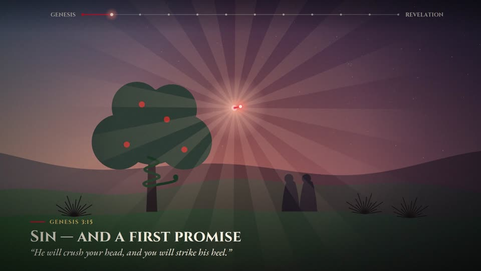 | 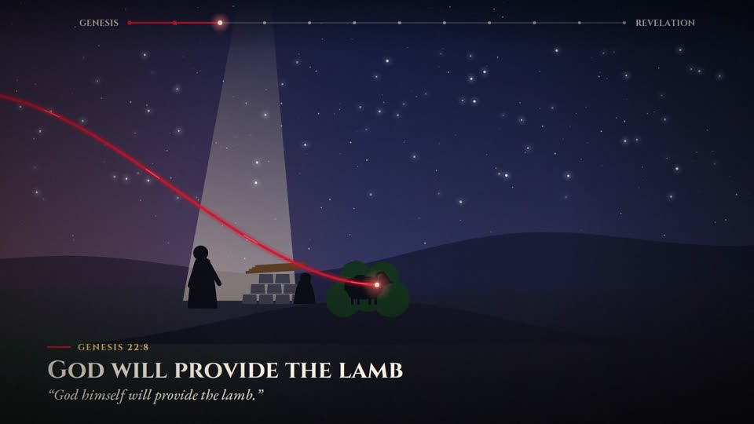 |
| 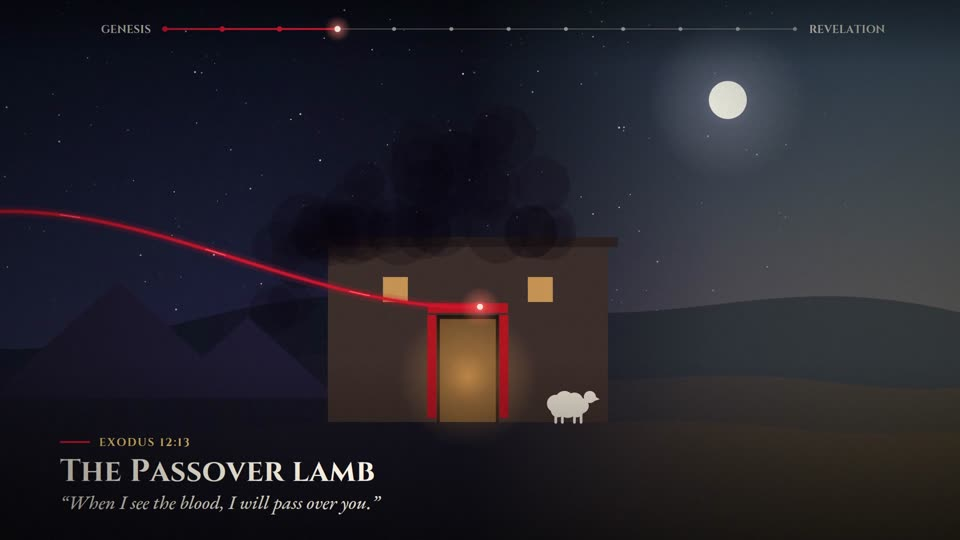 | 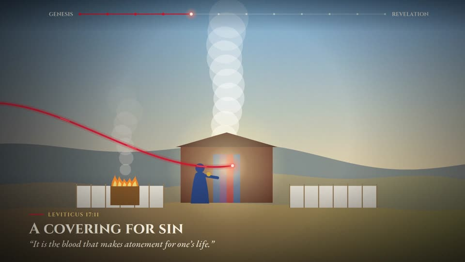 | 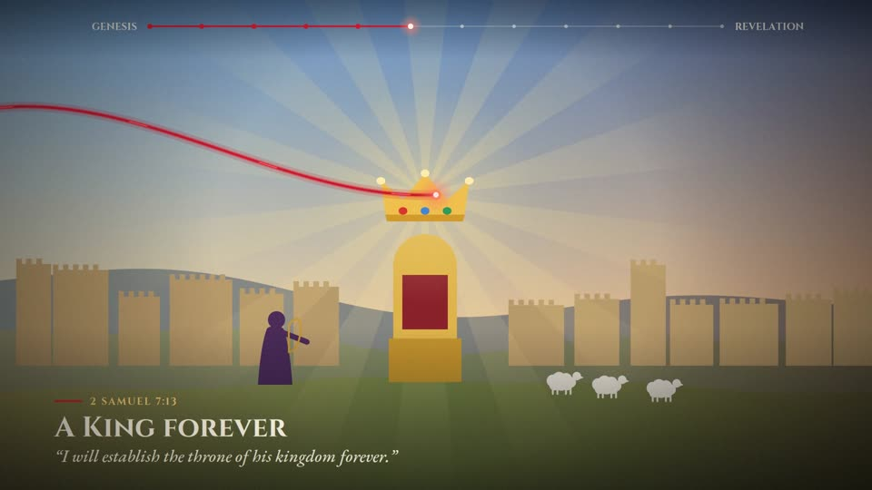 | 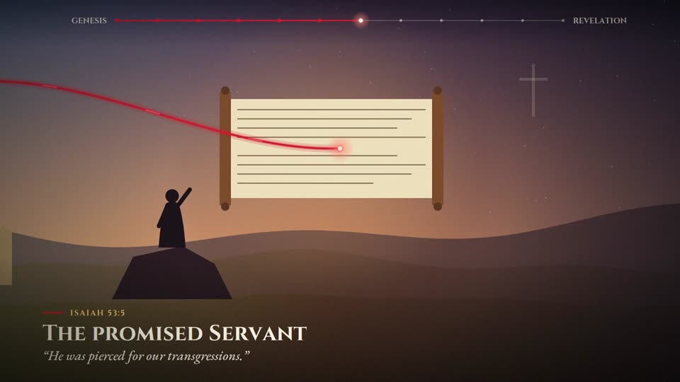 |
| 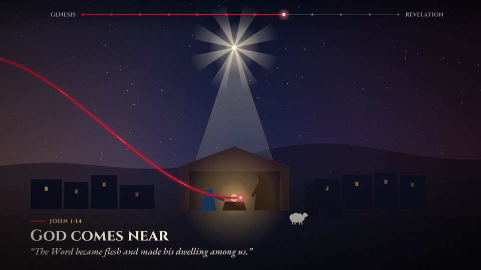 | 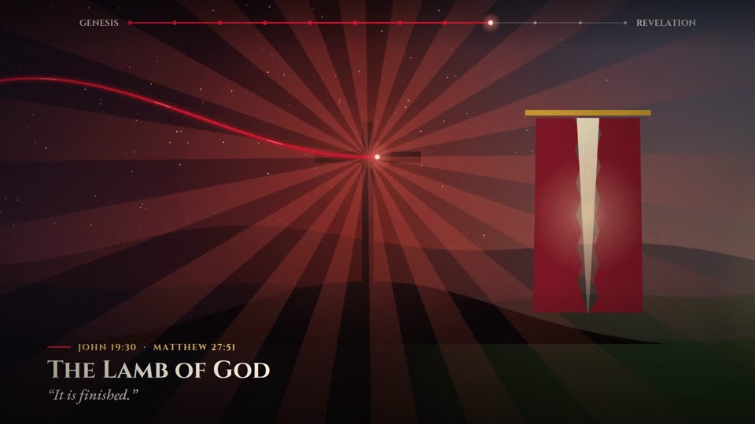 | 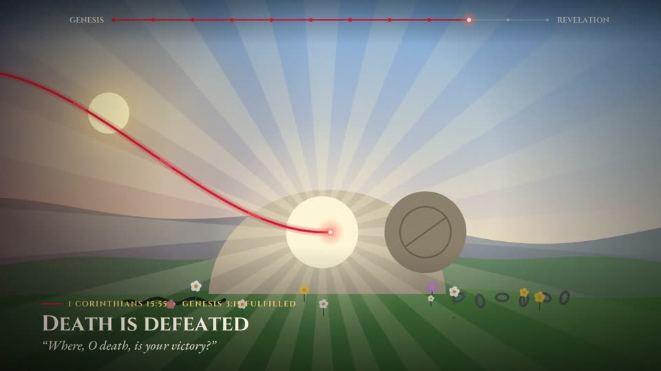 | 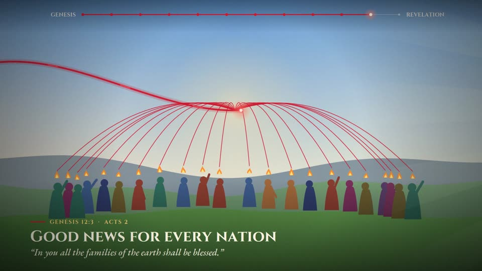 |
| 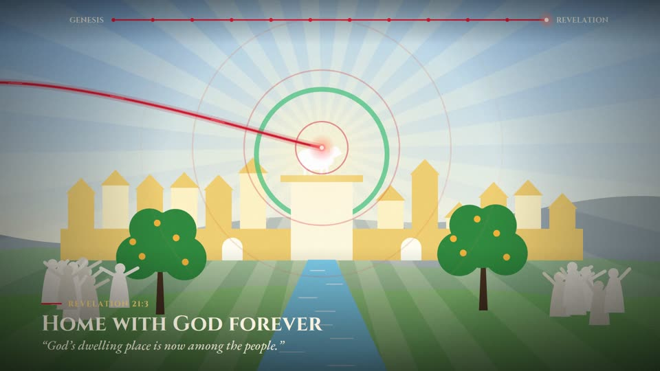 | 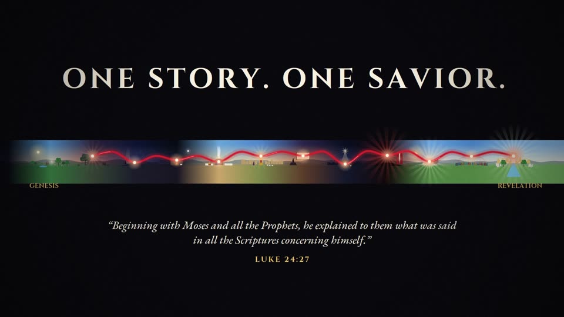 | | |


| # | Time | Scene | What we see | Animation | Caption |
|---|------|-------|-------------|-----------|---------|
| 0 | 0.0 to 3.2 | **Title** | Starry void. | Title letters rise in one after another; a scarlet stitch draws itself underneath. | *The Scarlet Thread*: The gospel from Genesis to Revelation |
| 1 | 3.2 to 7.5 | **Creation** | Eden at morning: sun, trees, the tree of life, and Adam and Eve walking beside a warm light (God's presence). | Travelling from the void brings the light in. Flowers bloom one after another; birds and trees move. | **Made to walk with God.** "God saw all that he had made, and it was very good." (Genesis 1:31) |
| 2 | 7.5 to 11.8 | **The Fall, and the first promise** | Dusk. A serpent coiled on the tree of knowledge, thorns, and the couple leaving with heads bowed. | A point of light gathers, pulls in, then flares; the serpent flinches back. **The scarlet thread starts at this light.** | **Sin, and a first promise.** "He will crush your head, and you will strike his heel." (Genesis 3:15) |
| 3 | 11.8 to 16.1 | **Abraham and Isaac** | Night on Mount Moriah: an altar, Abraham, Isaac, and a ram caught in a thicket. | A beam of light from above; Abraham's raised arm lowers; the thicket shakes. The thread goes through the ram. | **God will provide the lamb.** "God himself will provide the lamb." (Genesis 22:8) |
| 4 | 16.1 to 20.4 | **Passover** | A house in Egypt at night, a lamb beside it, pyramids behind. | Blood is brushed onto the lintel and doorposts. A dark wind sweeps through and passes over the house. The thread goes through the lintel. | **The Passover lamb.** "When I see the blood, I will pass over you." (Exodus 12:13) |
| 5 | 20.4 to 24.7 | **Tabernacle** | Desert. The courtyard, the altar with fire and smoke, the high priest, and a pillar of cloud. | The priest walks to the tent and the Most Holy Place begins to glow. The thread goes into the veil. | **A covering for sin.** "It is the blood that makes atonement for one's life." (Leviticus 17:11) |
| 6 | 24.7 to 29.0 | **King David** | Jerusalem at golden hour, an empty throne, David with a harp, and sheep. | A crown falls onto the thread, squashes and bounces, then settles; light rays behind it. | **A King forever.** "I will establish the throne of his kingdom forever." (2 Samuel 7:13) |
| 7 | 29.0 to 33.3 | **The prophets** | Dusk. Isaiah on a rock. | A scroll unrolls and its lines write themselves in; a faint cross shows in the sky ahead. | **The promised Servant.** "He was pierced for our transgressions." (Isaiah 53:5) |
| 8 | 33.3 to 37.6 | **Incarnation** | Night in Bethlehem: a stable, the star, Mary, Joseph and shepherds. | The thread comes down from the sky into the manger; the star's beam brightens; shepherds walk in. | **God comes near.** "The Word became flesh and made his dwelling among us." (John 1:14) |
| 9 | 37.6 to 41.9 | **The Cross** | Darkness over Golgotha. One cross; the temple curtain to the right. | The thread passes through the centre of the cross and flares. An earthquake shakes the camera, and the curtain tears from top to bottom. | **The Lamb of God.** "It is finished." (John 19:30 · Matthew 27:51) |
| 10 | 41.9 to 46.2 | **Resurrection** | Dawn at the garden tomb. The crushed serpent and broken chains lie on the ground. | The stone trembles, rocks back, then rolls away; light pours out; flowers open. | **Death is defeated.** "Where, O death, is your victory?" (1 Corinthians 15:55 · Genesis 3:15 fulfilled) |
| 11 | 46.2 to 50.5 | **Pentecost and the nations** | A crowd from many nations. | The thread splits into many strands, one to each person; flames of fire appear over their heads. | **Good news for every nation.** "In you all the families of the earth shall be blessed." (Genesis 12:3 · Acts 2) |
| 12 | 50.5 to 54.8 | **New Creation** | The New Jerusalem, the river of life, trees of life, a great crowd, and the Lamb on the throne. | The thread reaches the throne and opens into rings of light; a rainbow draws itself around the throne. | **Home with God forever.** "God's dwelling place is now among the people." (Revelation 21:3) |
| 13 | 54.8 to 60.0 | **Pull-back** | The whole panorama, Eden to New Jerusalem, stitched by one thread. | The camera zooms out on a logarithmic curve; each scene becomes a glowing bead on the thread. | **One story. One Savior.** "Beginning with Moses and all the Prophets, he explained… what was said in all the Scriptures concerning himself." (Luke 24:27) |

## Sound

A soft synthesized pad follows the mood of each scene: bright major chords in Eden, minor at the
Fall and the cross, rising at the resurrection, and the fullest chord in the New Creation. A bell
rings each time the thread reaches a scene's focal point, so the "stitches" can be heard.

## Rendering

```bash
pip install pycairo numpy imageio-ffmpeg
python3 render.py                     # writes the_scarlet_thread.mp4 (about 2 minutes on 4 cores)
python3 render.py --preview 6.4 40.8  # writes still PNGs at those times into preview/
```

`render.py` reuses the drawing helpers and fonts from `../bible-animation/`.
